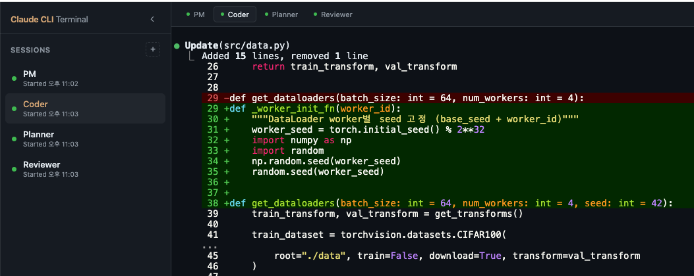

# Claude Web Terminal

브라우저에서 여러 Claude CLI 인스턴스를 탭으로 관리하는 웹 기반 멀티세션 터미널.


## 왜 Claude Web Terminal인가?

1. **인터넷 창을 닫아도 에이전트가 종료되지 않는다** — PTY 기반으로 Claude CLI 프로세스가 서버에서 독립 실행되므로, 브라우저를 닫거나 네트워크가 끊겨도 작업이 계속 진행된다. 다시 접속하면 그대로 이어서 확인할 수 있다.
2. **다수의 에이전트를 관리하기 편하다** — 탭/사이드바 UI로 여러 Claude CLI 세션을 한 화면에서 동시에 생성·전환·모니터링할 수 있다. 터미널 창을 여러 개 띄울 필요가 없다.

## 실제 생김새



## 주요 기능

- **멀티세션** — 여러 Claude CLI를 탭으로 동시 실행
- **실시간 터미널** — XTerm.js + WebSocket 기반 PTY I/O
- **외부 프로세스 감지** — 이미 실행 중인 Claude 프로세스에 연결
- **반응형 UI** — 사이드바 + 탭 기반 인터페이스

## 스택

| 구분 | 기술 |
|------|------|
| Backend | Python 3.10+ / aiohttp / PTY |
| Frontend | Vanilla HTML·CSS·JS / XTerm.js 5.5.0 |
| 통신 | WebSocket / REST API |

## 시작하기

### 요구사항

- Python 3.10+
- [Claude CLI](https://docs.anthropic.com/en/docs/claude-code) 설치 및 인증 완료
- aiohttp

### 설치 및 실행

```bash
pip install aiohttp
python3 server.py --host 0.0.0.0 --port 8080
```

브라우저에서 `http://localhost:8080` 접속.

### systemd 자동 실행 (선택)

```bash
# ~/.config/systemd/user/claude-web-terminal.service 생성 후
systemctl --user enable --now claude-web-terminal
sudo loginctl enable-linger $USER
```

## API

| Method | Path | Description |
|--------|------|-------------|
| `POST` | `/api/sessions` | 세션 생성 |
| `GET` | `/api/sessions` | 세션 목록 |
| `DELETE` | `/api/sessions/{id}` | 세션 삭제 |
| `GET` | `/ws/{id}` | 터미널 WebSocket |
| `GET` | `/api/external` | 외부 Claude 프로세스 감지 |

## 환경변수

| 변수 | 기본값 | 설명 |
|------|--------|------|
| `CLAUDE_CMD` | `claude` | Claude CLI 실행 경로 |

## 참고

- 인증 기능 없음 — 로컬 또는 신뢰할 수 있는 네트워크에서 사용
- 스크롤백 버퍼 200KB, I/O 폴링 10ms

## License

MIT
